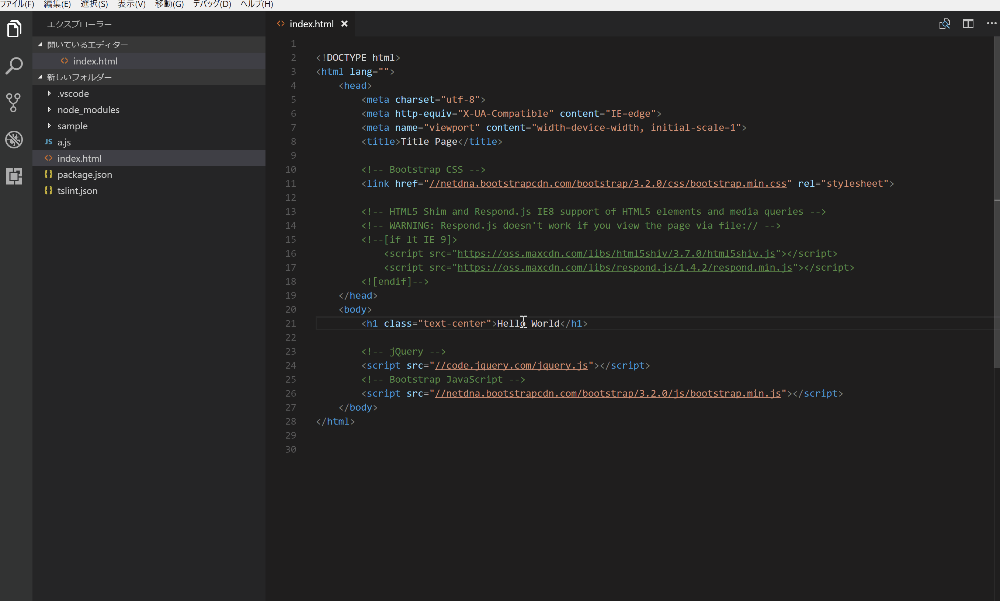

# vscode-preview-server

## Features

This extension provide preview of HTML which execute on web server.
When you save files, this extension automatically reload browser or side panel (live preview feature).
You can call these features from the context menu or editor menu.
The main features are as follows.

* `Preview on side panel (ctrl+shift+p)`: Open preview of HTML on side panel. With this feature, you can easely check the operation of HTML, CSS and JavaScript.
* `Launch on browser (ctrl+shift+l)`: Open Web Page on default browser. You can check all operation with web page.
* `Stop the web server (ctrl+shift+s)`: Stop the web server. This feature can be used only from command palette.
* `Resume the web server (ctrl+shift+r)`: Resume the web server. This feature can be used only from command palette.
* `show UI Page (ctrl+shift+u)`: Show UI Page. You can change options at UI page.



## Extension Settings

### Description
This extension contributes the following settings:

* `previewServer.browsers`: Browsers to launch. Even if you do not set this option, default browser launch if the ignoreDefaultBrowser is false. Default setting is *null*.
* `previewServer.ignoreDefaultBroswer`: Controls whether launch default browser or not. Default setting is *false*.
* `previewServer.isWatchConfiguration`: Controls whether resume the Web Server or not, when change settings. Default setting is *true*.
* `previewServer.port`: Port number of the Web Server. If you set *null*, vscode-preview-server generate random number, and set port as random number. Default setting is *8080*.
* `previewServer.proxy`: Set proxy. This is usefull when execute web app on another web server. Default setting is *""*.
* `previewServer.sync`: Controls whether synchronized or not. Default setting is *true*.
* `previewServer.ui`: Port number of UI Page. Default setting is *3001*.

### Example

```
{
    "previewServer.browsers": ["firefox", "chrome"],
    "previewServer.ignoreDefaultBroswer": true,
    "previewServer.port": 9999,
    "previewServer.ui": {
        "port": 3001,
        "weinrePort": 8081
    }
}
```

## Known Issues

`Preview on side panel` somethimes don't work with CDN, Link etc.

## Acknowledgements
This extension use [browsersync](https://www.browsersync.io/).
I would like to thank browsersync team for useful work.

## Lisence
[MIT](https://github.com/YuichiNukiyama/vscode-preview-server/blob/master/LICENSE)
